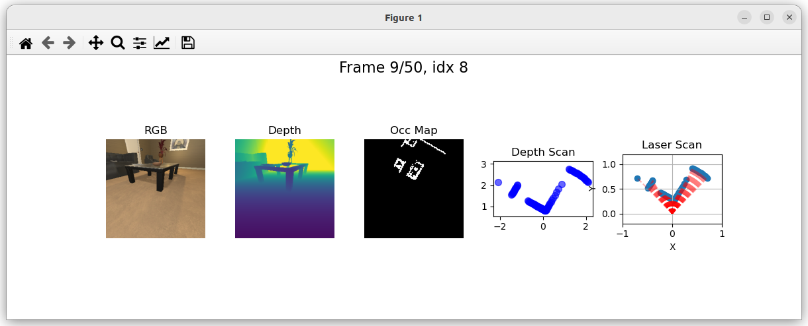
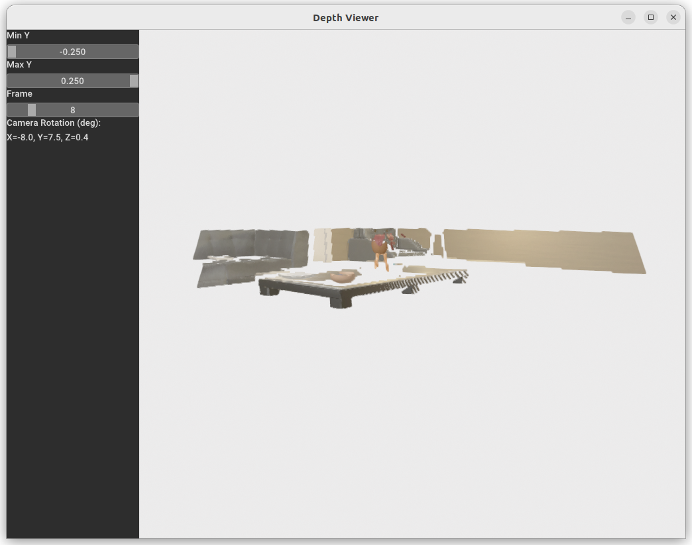

# depth_transform
The script for transform from RGB-D or Depth to Point Cloud, Occupancy Map, 2D Laser, which is convinient for using in single line code.

# Usage
Here are two apis which are convinient for using in sigle line code:
* depth_to_laser_scan
```
def depth_layer_scan_api(depth,
                         rgb=None,
                         height=None,
                         fov_deg=[90.0, 90.0],
                         dist_scale=1.0,
                         rotate_points=[['x', -30]],
                         filter_points=[['y', -0.25, 0.25]],
                         aggregation='min',
                         n_intervals=30,
                         default_value=3.0):
    """ 深度图投影到激光扫描 - API接口
    参数:   
        depth: HxW 深度图
        rgb: HxWx3 RGB图像 (可选)
        height: 相机高度，用于地面过滤 (可选)
        n_intervals: 深度扫描的区间数 (默认 30)
        default_value: 空区间的默认值 (默认 3) 
    returns:
        angles: 激光扫描角度 (n_intervals,) ndarray
        dists: 激光扫描距离 (n_intervals,) ndarray
    """
    # angles = np.linspace(fov_deg[0]/2, -fov_deg[0]/2, n_intervals)
    cfg = Config(
        corrdinate_system='opengl',
        sensor_cfg={"fov_deg": fov_deg, "dist_scale": dist_scale},
        transform_cfg={"rotate_points": rotate_points, "filter_points": filter_points},
        laserscan_cfg={"aggregation": aggregation, "n_intervals": n_intervals, "default_value": default_value}
    )
    x, y, angles, dist = depth_layer_scan(depth, rgb=rgb, height=height, cfg=cfg)
    if x is not None and y is not None:
        dist = dist / default_value # 归一化距离
    else: # 过滤点云为None，则直接返回最大距离
        dist = np.ones_like(angles)
    return np.rad2deg(angles), dist
```
* depth_to_occ_map:
```
def depth_layer_proj_api(
    depth, 
    rgb=None, 
    height=None, 
    fov_deg=[90.0, 90.0], # 默认90度视场角
    dist_scale=1.0, # 默认深度缩放比例1.0
    rotate_points=[['x', -30]],  # 默认旋转30°
    filter_points=[['y', -0.25, 0.25]],  # 默认过滤Y轴范围上下25cm
    map_resolution=0.2, # 默认地图分辨率20cm
    map_size=100, # 默认地图大小100x100
    coordinate_system='opengl'):
    """    深度图投影到占用栅格地图 - API接口
    参数:
        depth: HxW 深度图
        rgb: HxWx3 RGB图像 (可选)
        height: 相机高度，用于地面过滤 (可选)
        fov_deg: 相机水平和垂直视场角 (默认 [90.0, 90.0])
        dist_scale: 深度缩放比例 (默认 1.0)
        rotate_points: 旋转参数列表 (默认 [['x', -30]] 旋转30°)
        filter_points: 过滤参数列表 (默认 [['y', -0.25, 0.25]] 过滤Y轴范围上下25cm)
        map_resolution: 占用栅格地图分辨率 (默认 0.2m)
        map_size: 占用栅格地图大小 (默认 100x100)
        coordinate_system: 坐标系 ('opengl' 或 'opencv', 默认 'opengl')
    returns:
        layer: 点云坐标 (N, 3) ndarray
        color: 点云颜色 (N, 3) ndarray (如果有RGB图像)
        occ_map: 占用栅格地图 (size, size) ndarray
    """
    cfg = Config(
        corrdinate_system=coordinate_system,
        sensor_cfg={"fov_deg": fov_deg, "dist_scale": dist_scale},
        transform_cfg={"rotate_points": rotate_points, "filter_points": filter_points},
        projection_cfg={"map_resolution": map_resolution, "map_size": map_size}
    )
    layer, color, occ_map = depth_layer_proj(depth, rgb=rgb, height=height, cfg=cfg)
    return layer, color, occ_map
```

Here are another two functions which can be used for other projects:
* depth_to_pointcloud: The transform from RGBD or Depth to Point Cloud:
  * depth: depth information
  * rgb: img, can be none
  * cfg: transform config 
  * coordinate_system: 坐标系约定 ('opencv' 或 'opengl')\
            - opencv: X右, Y下, Z前\
            - opengl: X右, Y上, Z前
* depth_layer_proj: The transform from RGBD or Depth to Occupancy Map:
  * depth: depth information
  * rgb: img, can be none
  * cfg: transform config

Here are also two visual tools which will help you a lot: 
* PoinCloudFilterApp: have a view of point cloud\
  input same as above
* plot_data_frame: hav a view of rgb, depth and occ_map\
  input same as above

Open the shell or cmd and use below two commands to have a visual of input and ouput:
* ``` python .\depth_transform.py --cfg ./depth_transform.yaml --data /path/to/data --mode plot```
  * You can use <-, -> to change frame\


* ``` python .\depth_transform.py --cfg ./depth_transform.yaml --data /path/to/data --mode viewer```
  * You can change frame through silder of Frame on the left side bar\


If there is the error like this:\
'''libGL error: MESA-LOADER: failed to open swrast: /usr/lib/dri/swrast_dri.so: 无法打开共享目标文件: 没有那个文件或目录 (search paths /usr/lib/x86_64-linux-gnu/dri:\$${ORIGIN}/dri:/usr/lib/dri, suffix _dri)\
libGL error: failed to load driver: swrast\
libGL error: MESA-LOADER: failed to open swrast: /usr/lib/dri/swrast_dri.so: 无法打开共享目标文件: 没有那个文件或目录 (search paths /usr/lib/x86_64-linux-gnu/dri:\$${ORIGIN}/dri:/usr/lib/dri, suffix _dri)\
libGL error: failed to load driver: swrast\
段错误 (核心已转储)'''

Excute `LD_PRELOAD=/usr/lib/x86_64-linux-gnu/libstdc++.so.6` before tun the script, or you can add `/usr/lib/x86_64-linux-gnu/` to your LD_LIBRARY_PATH in .bashrc 

A statement of parameters in depth_tranform.yaml
* fov_deg: fov of RGBD, unit degree
* dist_scale:max distance of RGBD, unit meter
* rotate_points: SO3 tranform of output Point Cloud,  a example: [['z', -30], ['x', 30], ...]
* filter_points: Filter of output Point Cloud, a example: [['y', -0.25, 0.25], ...]
* map_resolution: Resolution of Occupancy Map
* map_size: Side length of Occupancy Map
* aggregation: The way of calculate the distance of a block depth
* n_intervals: The number of intervals for depth scan
* default_value: The max value of each intervals


